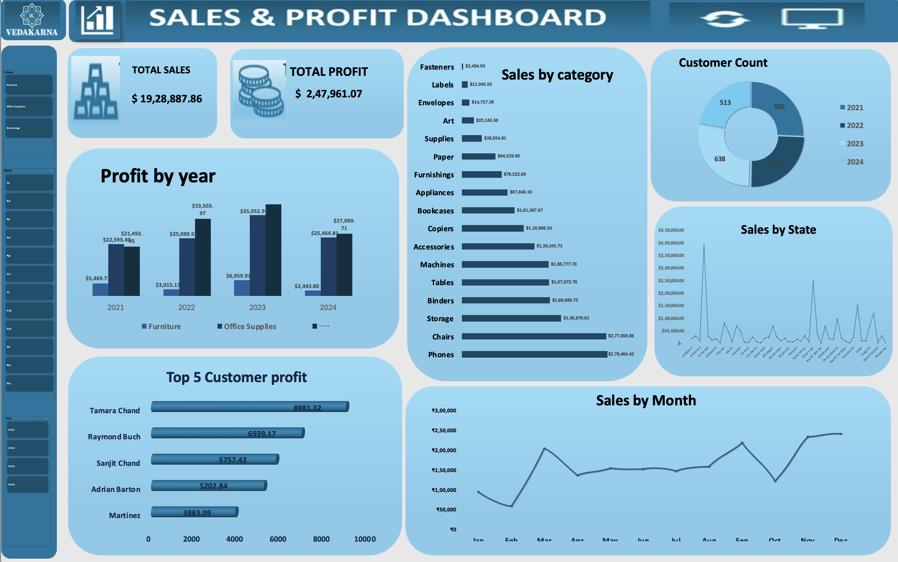

# Sales & Profit Dashboard | Excel

## About the Project

This project is a sales analysis dashboard built in Microsoft Excel. The goal was to turn raw sales data into a simple interactive report that makes it easier to understand revenue, profit, customers, products, and sales trends.

I worked with transaction-level sales data and used Excel to prepare the data, summarize it with Pivot Tables, and present the results through charts and slicers.

## Dataset at a Glance

- 8,314 sales records
- 11 columns
- 789 unique customers
- 49 states
- 3 categories: Furniture, Office Supplies, Technology
- 17 sub-categories
- Data from 2021 to 2024

## Excel Features Used

- Data preparation
- Pivot Tables
- Pivot Charts
- Slicers
- Lookup functions
- Data visualization
- Basic business analysis

## Key Numbers

| Metric | Value |
|---|---:|
| Total Sales | $1,928,887.86 |
| Total Profit | $247,961.07 |
| Profit Margin | 12.9% |
| Total Quantity | 31,508 |

## What the Dashboard Covers

- Profit by year
- Sales by category
- Customer count by year
- Sales by state
- Top 5 customers by profit
- Sales by month
- Interactive filtering by category, month, and year

## Key Findings

- Technology generated the highest sales and profit among the three main categories.
- Office Supplies generated a much higher profit margin than Furniture, even though their sales totals were relatively close.
- 2023 recorded the highest annual sales and total profit in the dataset.
- December had the highest monthly sales, while February had the lowest.
- Tables, Bookcases, and Supplies recorded negative overall profit and would need further investigation.
- State-level results show that higher sales do not always lead to higher profit.

## Project Outcome

The final dashboard brings the main sales and profit metrics into one place and allows the user to explore the data interactively. It was a practical exercise in using Excel for data analysis and presenting findings in a business-friendly format.

## Files

- `Sales_Profit_Dashboard.xlsx` — Excel workbook containing the analysis and dashboard
- `Dashboard_Preview.png` — preview image of the completed dashboard
- `Sales_Profit_Dashboard_Project_Documentation.docx` — detailed project documentation

## Dashboard Preview

The dashboard screenshot is included in this repository so the overall layout and analysis can be viewed at a glance.

## Learning Reference

This project was completed as part of my hands-on Excel learning journey, using an online tutorial as a reference and then working through the analysis and dashboard steps in Excel.
